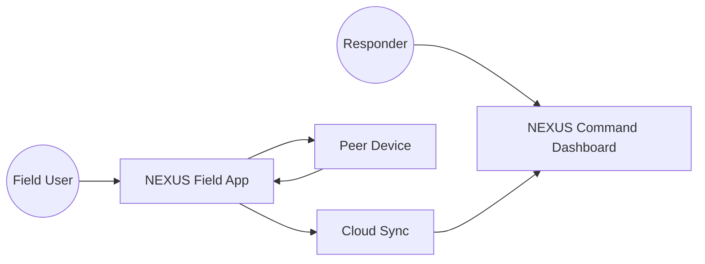
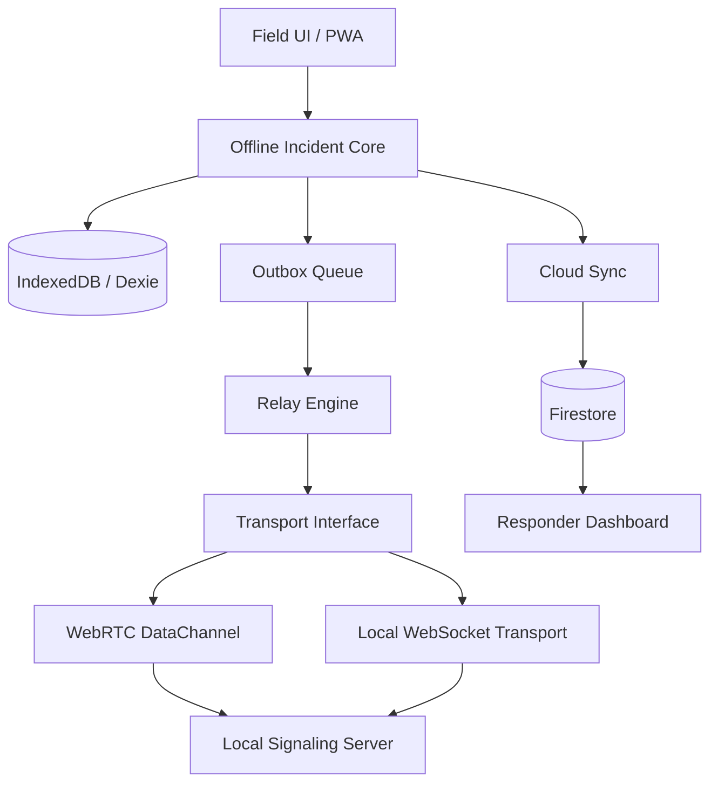
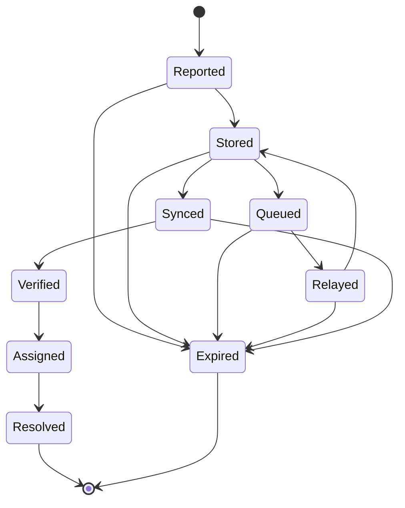
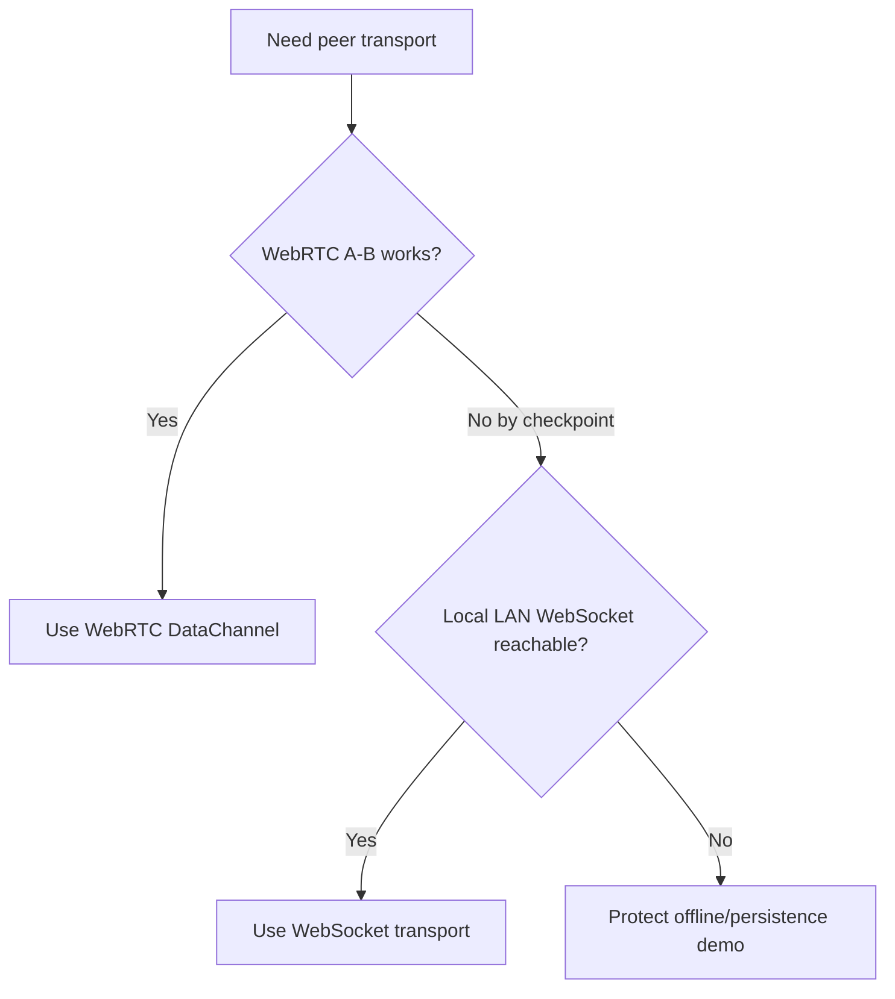
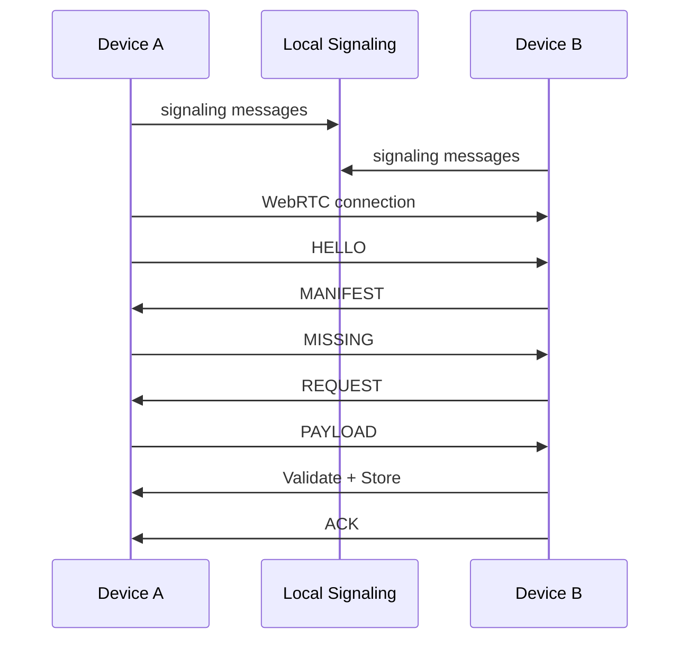

# NEXUS UML / Mermaid Source

## Use-case diagram

## Component diagram

## Incident state diagram

Expired is terminal for relay purposes but retained for audit/history.

## Transport decision

## Sequence: A -> B

