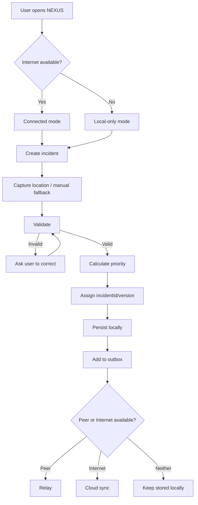
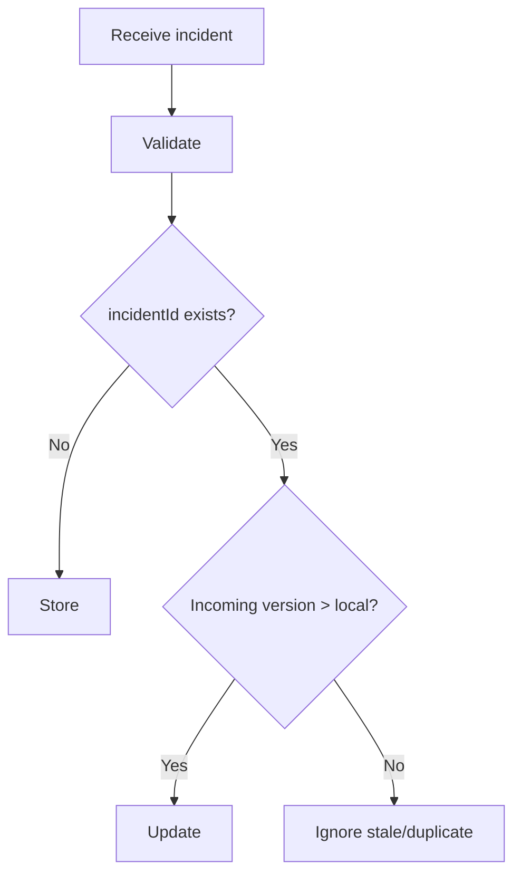

# NEXUS Flowcharts

## Incident creation

```mermaid
flowchart TD
  A[User opens NEXUS] --> B{Internet available?}
  B -->|Yes| C[Connected mode]
  B -->|No| D[Local-only mode]
  C --> E[Create incident]
  D --> E
  E --> F[Capture location / manual fallback]
  F --> G[Validate]
  G -->|Invalid| H[Ask user to correct]
  H --> G
  G -->|Valid| I[Calculate priority]
  I --> J[Assign incidentId/version]
  J --> K[Persist locally]
  K --> L[Add to outbox]
  L --> M{Peer or Internet available?}
  M -->|Peer| N[Relay]
  M -->|Internet| O[Cloud sync]
  M -->|Neither| P[Keep stored locally]
```

## Deduplication

```mermaid
flowchart TD
  A[Receive incident] --> B[Validate]
  B --> C{incidentId exists?}
  C -->|No| D[Store]
  C -->|Yes| E{Incoming version > local?}
  E -->|Yes| F[Update]
  E -->|No| G[Ignore stale/duplicate]
```

## Responder lifecycle

```mermaid
flowchart LR
  A[Reported] --> B[Synced]
  B --> C[Verified]
  C --> D[Assigned]
  D --> E[Resolved]
```
