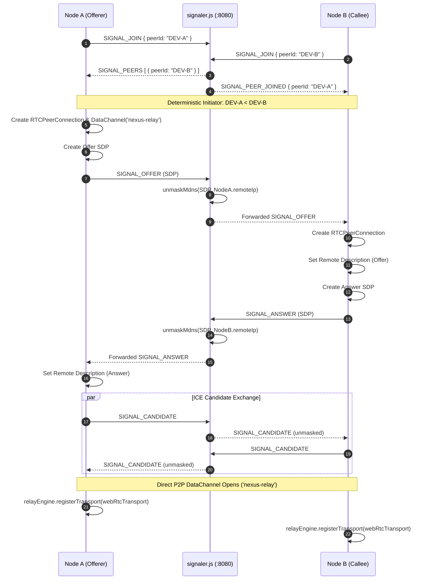

# NEXUS Transport Architecture Audit & Abstraction Roadmap

> **Document Status:** Comprehensive Technical Audit  
> **Date:** September 2026  
> **Target System:** NEXUS — Offline-First Emergency & Community Network  
> **Audited Modules:** `networking/`, `shared/`, `frontend/src/services/networkCoordinator.ts`, `frontend/src/context/ServiceContext.tsx`, `backend/data/`  
> **Recommendation:** **SAFE TO REFACTOR NOW** *(With strict minimal-boundary preservation)*

---

## Executive Summary & Final Recommendation

### Final Verdict: **SAFE TO REFACTOR NOW**

The NEXUS architecture is **exceptionally well-positioned** for introducing a generalized, multi-transport abstraction layer without rewriting code, migrating to Android native prematurely, or breaking the working WebRTC / WebSocket fallback implementation.

#### Why It Is Safe:
1. **The Relay Core is Already Transport-Agnostic:** [`RelayEngine`](file:///c:/Users/PRATIK%20DAS/OneDrive/Desktop/NEXUS/networking/relayEngine.ts) does **not** import `RTCPeerConnection`, `RTCDataChannel`, or `WebSocket`. It operates strictly on the existing [`ITransport`](file:///c:/Users/PRATIK%20DAS/OneDrive/Desktop/NEXUS/shared/interfaces.ts#L147-L155) interface.
2. **The Wire Protocol is 100% Decoupled:** The 6-stage store-carry-forward protocol in [`shared/protocol.ts`](file:///c:/Users/PRATIK%20DAS/OneDrive/Desktop/NEXUS/shared/protocol.ts) defines pure JSON envelopes (`HELLO`, `MANIFEST`, `REQUEST`, `PAYLOAD`, `ACK`, `FORWARD`, `PURGE`) that do not care about the underlying transport mechanism.
3. **Multi-Hop (A → B → C) is Transport-Independent:** Data propagation occurs through local storage ingestion ([`OfflineStorageAdapter`](file:///c:/Users/PRATIK%20DAS/OneDrive/Desktop/NEXUS/backend/data/adapter.ts)). A node can receive a payload over WebRTC and later forward it over WebSocket (or future BLE) without altering the relay logic.
4. **Coupling is Isolated to a Single File:** WebRTC negotiation, ICE candidate buffering, mDNS unmasking, and fallback watchdog timers are concentrated in [`frontend/src/services/networkCoordinator.ts`](file:///c:/Users/PRATIK%20DAS/OneDrive/Desktop/NEXUS/frontend/src/services/networkCoordinator.ts).

#### The Smallest Possible Implementation That Preserves All Behavior:
Introduce a 2-tier transport abstraction:
- **Tier 1 (Connection Level):** Retain and alias [`ITransport`](file:///c:/Users/PRATIK%20DAS/OneDrive/Desktop/NEXUS/shared/interfaces.ts#L147) as `NexusTransport`, broadening the `transportType` union to `TransportType = 'webrtc' | 'websocket' | 'ble' | 'wifi-direct' | 'wifi-aware' | 'nearby' | string`.
- **Tier 2 (Subsystem Level):** Introduce [`INexusTransportProvider`](#8-proposed-minimal-transport-abstraction) for managing transport lifecycle and peer discovery. Wrap the existing WebRTC coordinator logic and WebSocket fallback into conforming providers without altering their internal negotiation mechanics.

---

## Quick Reference: Answers to the 17 Audit Questions

| # | Question | Current State / Finding |
|---|---|---|
| **1** | **Where is WebRTC directly coupled to the NEXUS application?** | In [`networkCoordinator.ts`](file:///c:/Users/PRATIK%20DAS/OneDrive/Desktop/NEXUS/frontend/src/services/networkCoordinator.ts) (creates `RTCPeerConnection`, `RTCDataChannel`, handles ICE/SDP), in [`ServiceContext.tsx`](file:///c:/Users/PRATIK%20DAS/OneDrive/Desktop/NEXUS/frontend/src/context/ServiceContext.tsx) (instantiates coordinator, exposes WebRTC diagnostics), and in UI tabs ([`NodeTelemetry.tsx`](file:///c:/Users/PRATIK%20DAS/OneDrive/Desktop/NEXUS/frontend/src/admin/NodeTelemetry.tsx), [`NetworkTab.tsx`](file:///c:/Users/PRATIK%20DAS/OneDrive/Desktop/NEXUS/frontend/src/components/NetworkTab.tsx)) which inspect WebRTC states. |
| **2** | **Where is WebRTC directly coupled to the relay engine?** | **Nowhere in the data path.** [`RelayEngine.ts`](file:///c:/Users/PRATIK%20DAS/OneDrive/Desktop/NEXUS/networking/relayEngine.ts) only imports `ITransport`. The only coupling is cosmetic: `getStatus()` checks if `transportType === 'webrtc'` to set the mode badge, and `shared/interfaces.ts` defines `transportType: 'webrtc' \| 'websocket'`. |
| **3** | **What existing interfaces already abstract communication?** | [`ITransport`](file:///c:/Users/PRATIK%20DAS/OneDrive/Desktop/NEXUS/shared/interfaces.ts#L147) (connection-level), [`RelayMessage`](file:///c:/Users/PRATIK%20DAS/OneDrive/Desktop/NEXUS/shared/protocol.ts#L114) (wire-level envelope), [`INetworkRelayService`](file:///c:/Users/PRATIK%20DAS/OneDrive/Desktop/NEXUS/shared/interfaces.ts#L133) (service-level status), [`IOfflineStorageAdapter`](file:///c:/Users/PRATIK%20DAS/OneDrive/Desktop/NEXUS/shared/interfaces.ts#L36) (storage boundary). |
| **4** | **What parts of the current networking layer can be reused?** | **100% of:** [`relayEngine.ts`](file:///c:/Users/PRATIK%20DAS/OneDrive/Desktop/NEXUS/networking/relayEngine.ts), [`protocol.ts`](file:///c:/Users/PRATIK%20DAS/OneDrive/Desktop/NEXUS/shared/protocol.ts), [`signalingClient.ts`](file:///c:/Users/PRATIK%20DAS/OneDrive/Desktop/NEXUS/networking/signalingClient.ts), [`signaler.js`](file:///c:/Users/PRATIK%20DAS/OneDrive/Desktop/NEXUS/networking/signaler.js), [`webRtcTransport.ts`](file:///c:/Users/PRATIK%20DAS/OneDrive/Desktop/NEXUS/networking/webRtcTransport.ts), and [`webSocketTransport.ts`](file:///c:/Users/PRATIK%20DAS/OneDrive/Desktop/NEXUS/networking/webSocketTransport.ts). |
| **5** | **What parts should be refactored?** | [`networkCoordinator.ts`](file:///c:/Users/PRATIK%20DAS/OneDrive/Desktop/NEXUS/frontend/src/services/networkCoordinator.ts) (extract WebRTC lifecycle out of the coordinator god-object), [`shared/interfaces.ts`](file:///c:/Users/PRATIK%20DAS/OneDrive/Desktop/NEXUS/shared/interfaces.ts) (generalize `transportType` and diagnostic types), and consolidate/deprecate unused [`wsTransport.ts`](file:///c:/Users/PRATIK%20DAS/OneDrive/Desktop/NEXUS/networking/wsTransport.ts). |
| **6** | **Is WebRTC currently a transport adapter or is networking logic mixed into it?** | [`WebRtcTransport.ts`](file:///c:/Users/PRATIK%20DAS/OneDrive/Desktop/NEXUS/networking/webRtcTransport.ts) **is a clean adapter**. However, the *orchestration* (SDP offers/answers, ICE candidate queuing, fallback timers) is mixed directly into [`networkCoordinator.ts`](file:///c:/Users/PRATIK%20DAS/OneDrive/Desktop/NEXUS/frontend/src/services/networkCoordinator.ts). |
| **7** | **How does WebSocket fallback currently work?** | On peer discovery, a 3.5s timer starts. If WebRTC doesn't reach `'open'` (or `RTCPeerConnection` is missing), [`WebSocketTransport`](file:///c:/Users/PRATIK%20DAS/OneDrive/Desktop/NEXUS/networking/webSocketTransport.ts) is instantiated. Wire messages are tunneled via `{ type: 'SIGNAL_RELAY', fromPeerId, toPeerId, relayMessage }` through [`signaler.js`](file:///c:/Users/PRATIK%20DAS/OneDrive/Desktop/NEXUS/networking/signaler.js). |
| **8** | **How does peer discovery currently work?** | Mediated through [`signaler.js`](file:///c:/Users/PRATIK%20DAS/OneDrive/Desktop/NEXUS/networking/signaler.js) over WebSocket. Nodes send `SIGNAL_JOIN`, and the server distributes `SIGNAL_PEERS` and broadcasts `SIGNAL_PEER_JOINED` / `SIGNAL_PEER_LEFT`. Autonomous radio discovery is not yet implemented. |
| **9** | **How does signaling currently work?** | Zero-dependency Node HTTP/WS server on port 8080 (`signaler.js`). Relays SDP offers/answers/candidates, replaces Chrome `.local` mDNS hostnames with real LAN IPv4 addresses, and handles `SIGNAL_PURGE_ALL`. Tie-breaking: `localDeviceId < peer.peerId` initiates offer. |
| **10** | **Can WebRTC and WebSocket already be treated as interchangeable transports?** | **YES at the RelayEngine level** (both implement `ITransport`). **NO at the NetworkCoordinator level** (it holds separate maps, separate timers, and hardcoded WebRTC connection flows). |
| **11** | **What is the minimum safe refactoring needed to introduce a `NexusTransport` interface?** | 1. Alias/extend `ITransport` to `NexusTransport`.<br>2. Generalize `transportType` union.<br>3. Introduce `INexusTransportProvider` for subsystem lifecycle.<br>4. Wrap WebRTC and WebSocket in matching providers without modifying existing signaling logic. |
| **12** | **What files would need modification?** | [`shared/interfaces.ts`](file:///c:/Users/PRATIK%20DAS/OneDrive/Desktop/NEXUS/shared/interfaces.ts), [`frontend/src/services/networkCoordinator.ts`](file:///c:/Users/PRATIK%20DAS/OneDrive/Desktop/NEXUS/frontend/src/services/networkCoordinator.ts), [`networking/relayEngine.ts`](file:///c:/Users/PRATIK%20DAS/OneDrive/Desktop/NEXUS/networking/relayEngine.ts) (one line in `getStatus()`), and UI telemetry type consumption. |
| **13** | **What tests already cover these components?** | [`networking/test/relay.test.ts`](file:///c:/Users/PRATIK%20DAS/OneDrive/Desktop/NEXUS/networking/test/relay.test.ts) (5 relay/handshake scenarios), [`tests/integration/e2eRelay.test.ts`](file:///c:/Users/PRATIK%20DAS/OneDrive/Desktop/NEXUS/tests/integration/e2eRelay.test.ts) (E2E Dexie + UI subscription), [`networking/test/signaler.test.ts`](file:///c:/Users/PRATIK%20DAS/OneDrive/Desktop/NEXUS/networking/test/signaler.test.ts) (Signaler WS protocol). |
| **14** | **What tests would be required after introducing the abstraction?** | Unit tests for `INexusTransportProvider` registration, priority fallback tests (WebRTC failure triggering fallback), multi-transport relay verification, and regression runs of all existing suites. |
| **15** | **Could this refactoring be completed without changing the relay protocol?** | **YES, 100%.** Zero changes to `shared/protocol.ts` or the 6-stage handshake envelopes are needed. |
| **16** | **Could the existing A → B → C multi-hop relay continue unchanged?** | **YES, 100%.** Multi-hop operates at the storage/relay layer (`RelayEngine.ts`). It functions identically regardless of whether hops use WebRTC, WebSocket, or future BLE. |
| **17** | **Identify any risks that could break the current demo.** | 1. Breaking WebRTC ICE negotiation / mDNS replacement.<br>2. Breaking the 3.5s fallback watchdog timer.<br>3. Breaking UI diagnostics in `AdminDashboard` / `NetworkTab`.<br>4. Breaking Dexie reactive UI subscriptions. |

---

## 1. Current Networking Architecture

NEXUS currently implements a 4-tier communication stack running within a browser PWA shell on local Wi-Fi or mobile hotspots:

```
┌────────────────────────────────────────────────────────────────────────┐
│                        NEXUS REACT APPLICATION                         │
│   (ServiceContext, Incident Reporting Wizard, Map, Admin Telemetry)   │
└───────────────────────────────────┬────────────────────────────────────┘
                                    │
                                    ▼
┌────────────────────────────────────────────────────────────────────────┐
│                          NETWORK COORDINATOR                           │
│   (SignalingClient, Peer Discovery, WebRTC Orchestration, Fallback)   │
└───────────────┬───────────────────────────────────────┬────────────────┘
                │                                       │
                ▼                                       ▼
┌───────────────────────────────┐       ┌────────────────────────────────┐
│      WebRtcTransport          │       │      WebSocketTransport        │
│   (RTCDataChannel Adapter)    │       │   (Signaler Relay Tunnel)      │
└───────────────┬───────────────┘       └───────────────┬────────────────┘
                │                                       │
                └───────────────────┬───────────────────┘
                                    │
                       (Implements ITransport)
                                    │
                                    ▼
┌────────────────────────────────────────────────────────────────────────┐
│                      RELAY / STORE-CARRY-FORWARD                       │
│                         (RelayEngine.ts)                               │
│       6-Stage Handshake: HELLO → MANIFEST → REQUEST → PAYLOAD → ACK    │
│           Hop Budget (MAX_HOPS=3) · TTL Enforcement (24h)              │
└───────────────────────────────────┬────────────────────────────────────┘
                                    │
                                    ▼
┌────────────────────────────────────────────────────────────────────────┐
│                       OFFLINE STORAGE ADAPTER                          │
│                   (Dexie.js / IndexedDB Database)                      │
└────────────────────────────────────────────────────────────────────────┘
```

### Component Roles & Responsibilities:
1. **[`ServiceContext.tsx`](file:///c:/Users/PRATIK%20DAS/OneDrive/Desktop/NEXUS/frontend/src/context/ServiceContext.tsx):** React dependency injection root. Instantiates the Dexie database, [`OfflineStorageAdapter`](file:///c:/Users/PRATIK%20DAS/OneDrive/Desktop/NEXUS/backend/data/adapter.ts), [`RelayEngine`](file:///c:/Users/PRATIK%20DAS/OneDrive/Desktop/NEXUS/networking/relayEngine.ts), and [`NetworkCoordinator`](file:///c:/Users/PRATIK%20DAS/OneDrive/Desktop/NEXUS/frontend/src/services/networkCoordinator.ts).
2. **[`NetworkCoordinator.ts`](file:///c:/Users/PRATIK%20DAS/OneDrive/Desktop/NEXUS/frontend/src/services/networkCoordinator.ts):** Central manager that connects to signaling, detects peers, runs WebRTC negotiation, starts fallback timers, creates transports, and registers open transports with `RelayEngine`.
3. **[`SignalingClient.ts`](file:///c:/Users/PRATIK%20DAS/OneDrive/Desktop/NEXUS/networking/signalingClient.ts):** Typed WebSocket client communicating with the local signaling server.
4. **[`signaler.js`](file:///c:/Users/PRATIK%20DAS/OneDrive/Desktop/NEXUS/networking/signaler.js):** Zero-dependency Node.js HTTP/WebSocket server running on port 8080. Handles peer routing, mDNS address unmasking, and network-wide purges.
5. **[`WebRtcTransport.ts`](file:///c:/Users/PRATIK%20DAS/OneDrive/Desktop/NEXUS/networking/webRtcTransport.ts):** Wraps an active `RTCDataChannel` (`label: 'nexus-relay'`) to implement `ITransport`.
6. **[`WebSocketTransport.ts`](file:///c:/Users/PRATIK%20DAS/OneDrive/Desktop/NEXUS/networking/webSocketTransport.ts):** Wraps `SignalingClient.sendRelay()` to implement `ITransport` when WebRTC fails.
7. **[`RelayEngine.ts`](file:///c:/Users/PRATIK%20DAS/OneDrive/Desktop/NEXUS/networking/relayEngine.ts):** Orchestrates the deterministic 6-stage store-carry-forward handshake over any open `ITransport`.
8. **[`OfflineStorageAdapter.ts`](file:///c:/Users/PRATIK%20DAS/OneDrive/Desktop/NEXUS/backend/data/adapter.ts):** Implements `IOfflineStorageAdapter`, bridging `RelayEngine` to IndexedDB for incident validation, deduplication, and status updates.

---

## 2. Current WebRTC Flow



### Key Technical Details of the WebRTC Implementation:
- **Initiator Tie-Breaking:** `networkCoordinator.ts` uses deterministic string comparison: `this.deviceId < peer.peerId`. The lower ID always acts as offerer; the higher ID acts as callee.
- **Candidate Buffering:** If an ICE candidate arrives before `pc.setRemoteDescription()`, it is queued in `pendingCandidates` and drained via `drainPendingCandidates()`.
- **mDNS Hostname Unmasking:** Standard Chrome masks local IP addresses with random UUID `.local` hostnames for privacy. Over offline LANs, `.local` resolution fails. `signaler.js` inspects SDP and candidate payloads and substitutes `.local` strings with the sender's actual socket IPv4 address (`unmaskMdns()`).
- **Channel Label:** Fixed to `'nexus-relay'`. Callee listens for `pc.ondatachannel` and attaches it to `WebRtcTransport`.

---

## 3. Current WebSocket Fallback Flow

In real disaster or hackathon scenarios, venue Wi-Fi routers often enable **AP Client Isolation**, preventing direct peer-to-peer UDP/TCP packets between connected phones. NEXUS has an automated fallback watchdog:

```
[Peer Discovered]
       │
       ▼
[Start 3.5s Fallback Watchdog Timer]
       │
       ├──────────────────────────────────────────┐
       │ (Within 3.5s)                            │ (After 3.5s Timeout OR
       ▼                                          │  RTCPeerConnection unsupported)
[WebRTC DataChannel Opens]                        ▼
       │                                 [Activate WebSocket Fallback]
       ▼                                          │
[Clear Fallback Timer]                            ▼
[Register WebRtcTransport]              [Instantiate WebSocketTransport]
                                                  │
                                                  ▼
                                        [Register with RelayEngine]
                                                  │
                                                  ▼
                                        [Tunnel wire messages via
                                         SIGNAL_RELAY to signaler.js]
```

### Tunneling Mechanism:
1. When `WebSocketTransport.send(message)` is called, it packages the payload as:
   ```json
   {
     "type": "SIGNAL_RELAY",
     "fromPeerId": "DEV-A",
     "toPeerId": "DEV-B",
     "relayMessage": { "type": "HELLO", "messageId": "...", ... },
     "timestamp": 1725732000000
   }
   ```
2. `signaler.js` receives `SIGNAL_RELAY`, looks up `DEV-B` in its connected peers map, and forwards the frame directly.
3. Node B's `SignalingClient` receives `SIGNAL_RELAY` and calls `WebSocketTransport.handleIncomingRelay()`.
4. The exact same 6-stage relay protocol executes. Neither `RelayEngine` nor `IndexedDB` is aware that packets traveled over WebSocket rather than WebRTC.

---

## 4. Current Signaling Flow

[`signaler.js`](file:///c:/Users/PRATIK%20DAS/OneDrive/Desktop/NEXUS/networking/signaler.js) is a custom, zero-dependency Node.js service:
- **Port:** Defaults to `8080` (configurable via `PORT` env var).
- **HTTP Endpoints:**
  - `GET /health` or `GET /status`: Returns JSON status, connected peer count, and IP mappings.
  - `GET /purge`: Broadcasts `SIGNAL_PURGE_ALL` to reset all test state across the network.
- **WebSocket Protocol (RFC 6455):** Handcrafted frame parser and encoder supporting unmasked/masked text frames and ping/pong keepalives.
- **Signaling Message Vocabulary:**
  - `SIGNAL_JOIN` / `SIGNAL_PEERS` / `SIGNAL_PEER_JOINED` / `SIGNAL_PEER_LEFT`
  - `SIGNAL_OFFER` / `SIGNAL_ANSWER` / `SIGNAL_CANDIDATE`
  - `SIGNAL_RELAY` (Fallback tunneling)
  - `SIGNAL_PURGE_ALL` (Global wipe)
  - `SIGNAL_ERROR`

---

## 5. Current Relay Interaction (Store-Carry-Forward)

The [`RelayEngine`](file:///c:/Users/PRATIK%20DAS/OneDrive/Desktop/NEXUS/networking/relayEngine.ts) implements the 6-stage store-carry-forward state machine:

```
Peer A                                                     Peer B
  │                                                           │
  │─── Stage 1: HELLO (sessionId, capabilities) ─────────────>│
  │<── Stage 1: HELLO (reply if callee) ──────────────────────│
  │                                                           │
  │─── Stage 2: MANIFEST (items: [{id, version}]) ───────────>│
  │<── Stage 2: MANIFEST (items: [{id, version}]) ────────────│
  │                                                           │
  │    (Diffs remote manifest vs local Dexie database)        │
  │─── Stage 4: REQUEST (requestedIds: [id1, id2]) ──────────>│
  │                                                           │
  │    (Checks hopCount < MAX_HOPS, checks TTL, hopCount + 1) │
  │<── Stage 5: PAYLOAD (incidents: [inc1, inc2]) ────────────│
  │                                                           │
  │    (Validates schema, persists in Dexie storage)          │
  │─── Stage 6: ACK (acceptedIds: [id1], rejectedItems) ─────>│
  │                                                           │
  │    (Peer B marks incident status = 'relayed')             │
```

### Golden Rules Enforced in Code:
1. **Store before forwarding:** A node must write the incident to local IndexedDB before relaying it to subsequent peers.
2. **Increment hopCount upon forwarding:** When preparing a `PAYLOAD`, `hopCount` is incremented by 1 ([`relayEngine.ts:253`](file:///c:/Users/PRATIK%20DAS/OneDrive/Desktop/NEXUS/networking/relayEngine.ts#L253)).
3. **Hop Budget Cap:** If `inc.hopCount > MAX_HOPS` (fixed at `3`), the incident is rejected with error code `HOP_BUDGET_EXCEEDED` ([`relayEngine.ts:274`](file:///c:/Users/PRATIK%20DAS/OneDrive/Desktop/NEXUS/networking/relayEngine.ts#L274)).
4. **TTL Pruning:** Incidents older than their TTL budget (default 24h) are rejected with `TTL_EXPIRED`.
5. **Deduplication & Monotonic Versioning:** If incoming version $\le$ local version, it is rejected with `STALE_VERSION`. If incoming version $>$ local version, local data is updated.

---

## 6. Existing Abstractions

The project already has foundational abstraction boundaries:

### 1. `ITransport` ([`shared/interfaces.ts:147`](file:///c:/Users/PRATIK%20DAS/OneDrive/Desktop/NEXUS/shared/interfaces.ts#L147))
```typescript
export interface ITransport {
  readonly transportType: 'webrtc' | 'websocket';
  readonly remotePeerId: string;
  isOpen(): boolean;
  send(message: RelayMessage): Promise<void>;
  onMessage(handler: (message: RelayMessage) => void): void;
  onClose(handler: (reason?: string) => void): void;
  close(): void;
}
```
*Current Status:* Excellent peer connection abstraction. Both `WebRtcTransport` and `WebSocketTransport` already conform to this.

### 2. `RelayMessage` ([`shared/protocol.ts:114`](file:///c:/Users/PRATIK%20DAS/OneDrive/Desktop/NEXUS/shared/protocol.ts#L114))
*Current Status:* Fully transport-independent discriminated union representing the wire protocol.

### 3. `IOfflineStorageAdapter` ([`shared/interfaces.ts:36`](file:///c:/Users/PRATIK%20DAS/OneDrive/Desktop/NEXUS/shared/interfaces.ts#L36))
*Current Status:* Clean storage abstraction. Decouples `RelayEngine` from Dexie/IndexedDB.

### 4. Duplicate WebSocket Implementations Discovered:
- [`networking/webSocketTransport.ts`](file:///c:/Users/PRATIK%20DAS/OneDrive/Desktop/NEXUS/networking/webSocketTransport.ts): **Active & used.** Wraps `SignalingClient` to tunnel `SIGNAL_RELAY`.
- [`networking/wsTransport.ts`](file:///c:/Users/PRATIK%20DAS/OneDrive/Desktop/NEXUS/networking/wsTransport.ts): **Orphaned.** Wraps a direct 1:1 `WebSocket` instance; not imported or used anywhere in the app.

---

## 7. Coupling Problems Identified

Despite the clean `ITransport` abstraction in `RelayEngine`, four coupling bottlenecks exist in the application layer:

### Problem 1: `NetworkCoordinator` is a WebRTC "God Object"
[`frontend/src/services/networkCoordinator.ts`](file:///c:/Users/PRATIK%20DAS/OneDrive/Desktop/NEXUS/frontend/src/services/networkCoordinator.ts) is 676 lines long and mixes:
- Signaling client connection and event handling.
- Direct instantiation of browser `RTCPeerConnection` and `RTCDataChannel`.
- ICE candidate queuing and draining.
- SDP offer/answer generation.
- 3.5s watchdog fallback timer management.
- WebRTC-specific diagnostics collation.
*Impact:* Adding BLE or Wi-Fi Direct would require bloating `NetworkCoordinator` with more disparate radio logic.

### Problem 2: Hardcoded Transport Type Unions
- `shared/interfaces.ts` defines `transportType: 'webrtc' | 'websocket'`.
- `ConnectedPeerInfo.transportType` is `'webrtc' | 'websocket'`.
- `NetworkTransportMode` is `'disconnected' | 'signaling' | 'webrtc' | 'websocket-fallback'`.
*Impact:* Adding a new transport (e.g., `'ble'` or `'wifi-direct'`) causes TypeScript compilation errors across shared interfaces.

### Problem 3: Leaky Telemetry Interfaces
`PeerConnectionDiagnostic` in `networkCoordinator.ts` directly references browser WebRTC types:
```typescript
connectionState: RTCPeerConnectionState | 'unsupported';
iceConnectionState: RTCIceConnectionState | 'unsupported';
dataChannelState: RTCDataChannelState | 'none';
```
These WebRTC-specific fields are read directly by [`NodeTelemetry.tsx`](file:///c:/Users/PRATIK%20DAS/OneDrive/Desktop/NEXUS/frontend/src/admin/NodeTelemetry.tsx) and [`NetworkTab.tsx`](file:///c:/Users/PRATIK%20DAS/OneDrive/Desktop/NEXUS/frontend/src/components/NetworkTab.tsx).

### Problem 4: Missing "Transport Provider" / "Subsystem" Abstraction
`ITransport` only models an **already established point-to-point connection** to one peer (`send()`, `onMessage()`, `close()`).  
There is no interface representing the **transport subsystem** (how to start listening, discover peers, initiate a connection, and report adapter capabilities).

---

## 8. Proposed Minimal Transport Abstraction

To achieve the desired layered architecture without rewriting working code, we introduce a lightweight, 2-tier contract:

```
┌────────────────────────────────────────────────────────┐
│                    NEXUS Core                          │
│        (RelayEngine / Store-Carry-Forward)             │
└───────────────────────────┬────────────────────────────┘
                            │
               Tier 1: NexusTransport (Active Link)
                            │
┌───────────────────────────┴────────────────────────────┐
│              INexusTransportProvider                   │
│               (Subsystem Lifecycle)                    │
└───────┬───────────────────┬────────────────────┬───────┘
        │                   │                    │
        ▼                   ▼                    ▼
┌───────────────┐   ┌───────────────┐   ┌────────────────┐
│    WebRTC     │   │   WebSocket   │   │  Future Radios │
│   Provider    │   │   Provider    │   │  (BLE, WiFi-D) │
└───────────────┘   └───────────────┘   └────────────────┘
```

### Tier 1: Connection Abstraction (`NexusTransport`)
We preserve and expand [`ITransport`](file:///c:/Users/PRATIK%20DAS/OneDrive/Desktop/NEXUS/shared/interfaces.ts#L147):

```typescript
// shared/interfaces.ts

export type TransportType = 
  | 'webrtc' 
  | 'websocket' 
  | 'ble' 
  | 'wifi-direct' 
  | 'wifi-aware' 
  | 'nearby' 
  | (string & {});

export interface NexusTransport {
  readonly transportType: TransportType;
  readonly remotePeerId: string;
  readonly localDeviceId?: string;
  isOpen(): boolean;
  send(message: RelayMessage): Promise<void>;
  onMessage(handler: (message: RelayMessage) => void): void;
  onClose(handler: (reason?: string) => void): void;
  close(reason?: string): void;
  
  // Optional link metadata for multi-transport routing
  readonly metadata?: {
    mtu?: number;
    estimatedBandwidth?: 'low' | 'medium' | 'high';
    isDirectP2P?: boolean;
  };
}

// Backward-compatible alias so existing code continues working
export type ITransport = NexusTransport;
```

### Tier 2: Subsystem Provider Abstraction (`INexusTransportProvider`)
Represents a transport engine capable of discovering peers and producing `NexusTransport` connections:

```typescript
// networking/transportProvider.ts

export interface TransportProviderDiagnostics {
  id: TransportType;
  name: string;
  isAvailable: boolean;
  isActive: boolean;
  activePeerCount: number;
  details?: Record<string, unknown>;
}

export interface INexusTransportProvider {
  /** Unique transport identifier (e.g. 'webrtc', 'websocket', 'ble') */
  readonly id: TransportType;

  /** Human-readable display name (e.g. 'WebRTC Direct P2P', 'LAN WebSocket Fallback') */
  readonly name: string;

  /** Priority ranking for transport selection (higher = preferred) */
  readonly priority: number;

  /** Checks if the platform / browser supports this transport */
  isSupported(): boolean;

  /** Starts the transport subsystem */
  start(): Promise<void>;

  /** Stops the transport subsystem and disconnects active peers */
  stop(): Promise<void>;

  /** Event hook: Fired when an active peer transport connection is established */
  onTransportReady(handler: (transport: NexusTransport) => void): void;

  /** Event hook: Fired when a peer is discovered via this transport */
  onPeerDiscovered?(handler: (peerId: string, deviceId: string) => void): void;

  /** Event hook: Fired when a peer disconnects */
  onPeerLost?(handler: (peerId: string) => void): void;

  /** Diagnostic information for UI display */
  getDiagnostics(): TransportProviderDiagnostics;
}
```

---

## 9. Files That Would Change

| File | Change Type | Scope of Modification |
|---|---|---|
| [`shared/interfaces.ts`](file:///c:/Users/PRATIK%20DAS/OneDrive/Desktop/NEXUS/shared/interfaces.ts) | **Modify** | 1. Define `TransportType` union.<br>2. Define `NexusTransport` (aliasing `ITransport`).<br>3. Generalize `ConnectedPeerInfo.transportType`.<br>4. Generalize `NetworkTransportMode`. |
| [`networking/transportProvider.ts`](file:///c:/Users/PRATIK%20DAS/OneDrive/Desktop/NEXUS/networking/) | **New File** | Define `INexusTransportProvider` and `TransportProviderDiagnostics` interfaces. |
| [`networking/relayEngine.ts`](file:///c:/Users/PRATIK%20DAS/OneDrive/Desktop/NEXUS/networking/relayEngine.ts) | **Modify** | Update `getStatus()` mode computation to accept generic `TransportType` rather than assuming only `'webrtc'` exists. |
| [`networking/webRtcTransport.ts`](file:///c:/Users/PRATIK%20DAS/OneDrive/Desktop/NEXUS/networking/webRtcTransport.ts) | **Touch Minimal** | Implements `NexusTransport`. Zero behavioral changes. |
| [`networking/webSocketTransport.ts`](file:///c:/Users/PRATIK%20DAS/OneDrive/Desktop/NEXUS/networking/webSocketTransport.ts) | **Touch Minimal** | Implements `NexusTransport`. Zero behavioral changes. |
| [`frontend/src/services/networkCoordinator.ts`](file:///c:/Users/PRATIK%20DAS/OneDrive/Desktop/NEXUS/frontend/src/services/networkCoordinator.ts) | **Refactor** | Refactor internal structure to manage a list of `INexusTransportProvider`s while preserving existing WebRTC negotiation and fallback timing exactly as-is. |
| [`frontend/src/services/networkDiagnostics.ts`](file:///c:/Users/PRATIK%20DAS/OneDrive/Desktop/NEXUS/frontend/src/services/) | **New/Extract** | Decouple WebRTC-specific diagnostics from generic transport status so UI tabs can render any transport. |
| [`networking/wsTransport.ts`](file:///c:/Users/PRATIK%20DAS/OneDrive/Desktop/NEXUS/networking/wsTransport.ts) | **Deprecate** | Mark as deprecated or remove to avoid confusion with `webSocketTransport.ts`. |
| [`shared/protocol.ts`](file:///c:/Users/PRATIK%20DAS/OneDrive/Desktop/NEXUS/shared/protocol.ts) | **NO CHANGE** | **Zero modifications.** Wire protocol remains completely untouched. |
| [`backend/data/*`](file:///c:/Users/PRATIK%20DAS/OneDrive/Desktop/NEXUS/backend/data/) | **NO CHANGE** | **Zero modifications.** Storage, Dexie schema, outbox, and priority services remain untouched. |

---

## 10. Tests Affected & Testing Roadmap

### Existing Tests That Must Pass Regress-Free:
1. **[`networking/test/relay.test.ts`](file:///c:/Users/PRATIK%20DAS/OneDrive/Desktop/NEXUS/networking/test/relay.test.ts):**
   - 5 isolated scenarios: A → B transfer, A → B → C multi-hop, deduplication/versioning, max hop budget (3), and TTL expiration.
2. **[`tests/integration/e2eRelay.test.ts`](file:///c:/Users/PRATIK%20DAS/OneDrive/Desktop/NEXUS/tests/integration/e2eRelay.test.ts):**
   - End-to-end integration test verifying `FrontendIncidentService` → `OfflineStorageAdapter` (Dexie) → `RelayEngine` → `PairedMockTransport` → reactive UI subscription.
3. **[`networking/test/signaler.test.ts`](file:///c:/Users/PRATIK%20DAS/OneDrive/Desktop/NEXUS/networking/test/signaler.test.ts):**
   - Verifies WebSocket upgrade, health checks, and peer discovery framing.
4. **All Vitest backend suites:**
   - `schema.test.ts`, `outboxService.test.ts`, `incidentService.test.ts`, `dedup.test.ts`, `priority.test.ts`, `ttl.test.ts`, `deviceId.test.ts`, `adapter.test.ts`.

### New Tests to Add Upon Introducing Abstraction:
1. **`transportAbstraction.test.ts`:**
   - Verify that any custom mock conforming to `NexusTransport` can be registered with `RelayEngine`.
   - Verify that `RelayEngine.getStatus()` correctly reflects arbitrary transport types (e.g. `'ble'`, `'wifi-direct'`).
2. **`transportFallback.test.ts`:**
   - Mock a failing primary transport provider (WebRTC timeout) and assert that the secondary provider (WebSocket fallback) engages and completes the relay handshake.
3. **Multi-Transport Interoperability Test:**
   - Simulate Node A connected to Node B over WebRTC, and Node B connected to Node C over a simulated BLE/Mock transport. Verify that incident data flows A → B → C across disparate transport types seamlessly.

---

## 11. Risk Assessment & Mitigation Matrix

| Risk | Severity | Probability | Mitigation Strategy |
|---|---|---|---|
| **Breaking WebRTC ICE / SDP Negotiation** | **CRITICAL** | Low | Do **not** rewrite SDP offer/answer code or mDNS unmasking logic. Only encapsulate the existing working code into a `WebRtcTransportProvider`. |
| **Breaking 3.5s Fallback Watchdog** | **HIGH** | Medium | Maintain the exact fallback timer logic in the provider manager. If WebRTC does not open in 3500ms, immediately trigger fallback. |
| **UI Telemetry / Diagnostic Compilation Errors** | **MEDIUM** | Medium | Keep `PeerConnectionDiagnostic` fields optional or provide a generic wrapper so `AdminDashboard` and `NodeTelemetry` continue to compile without rewriting their JSX. |
| **Breaking Multi-Node Browser Testing (`?node=A`, `?node=B`)** | **HIGH** | Low | Ensure URL parameter parsing in `ServiceContext.tsx` and deterministic initiator selection (`this.deviceId < peer.peerId`) remain completely intact. |
| **Scope Creep / Wasted Hackathon Time** | **HIGH** | High | Strictly follow the minimal boundary implementation. **Do not** attempt to write Android JNI, BLE drivers, or Wi-Fi Direct during this refactoring phase. |

---

## 12. Recommended Implementation Order

When authorized to proceed with implementation, execute in these strict incremental phases:

```
Phase 1: Contract Evolution (Zero Runtime Impact)
   ├── Define TransportType & NexusTransport in shared/interfaces.ts
   ├── Alias ITransport = NexusTransport (100% backward compatibility)
   └── Run npm run test:all (Must pass with 0 errors)
         │
         ▼
Phase 2: Introduce Transport Provider Contract
   ├── Create networking/transportProvider.ts (INexusTransportProvider)
   └── Add unit tests verifying provider registration
         │
         ▼
Phase 3: Encapsulate Transports Without Touching Protocol
   ├── Wrap existing WebRTC logic into WebRtcTransportProvider
   ├── Wrap existing WebSocket fallback into WebSocketTransportProvider
   └── Update NetworkCoordinator to orchestrate providers
         │
         ▼
Phase 4: Multi-Node Verification & Telemetry
   ├── Run npm run test:all
   ├── Test two browser windows with ?node=A and ?node=B on local Wi-Fi
   └── Verify WebRTC connection and WebSocket fallback toggle in Diagnostics
```

---

## Conclusion

NEXUS does **not** have a deeply flawed architecture. On the contrary, the separation between the storage core, the relay state machine, and the transport interface is already clean. 

Refactoring to support multi-transport is **safe to execute now**, provided the existing WebRTC and WebSocket logic is preserved inside provider wrappers rather than rewritten.
